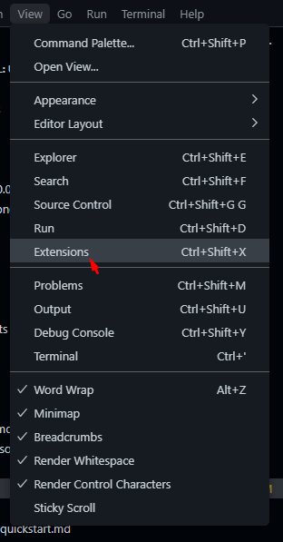
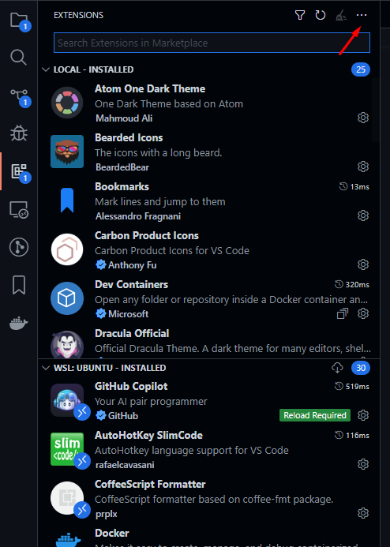
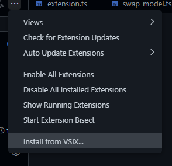
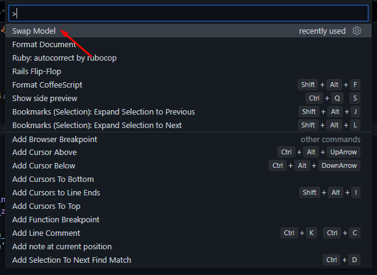
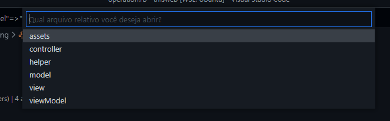

# Swap Model

## Descrição

Trata-se de um extensão para o VSCode para abrir alguns arquivos estando em outro.

Por exemplo, pode-se pular de um model para seu controller, contanto que os mesmo estejam nos caminhos padrão.

## Download

[Acesse o Link](public/swapmodel-0.0.1.vsix)

E clique em "Download" na página.

## Instalação

Dentro do VSCode, nos menus do topo clique em Seleção/Selection e depois em Extenões/Extensions



Clique 3 pontinhos do canto superior direito



E depois na última opção para instalar uma extensão a partir de um VSIX,



## Uso
Basta usar o seguinte comando no VScode.
```
  Ctrl + shift + p
```



Escolhendo o Swap Model abrirá uma menu contendo o tipo de arquivo ao qual deseja se locomover.


